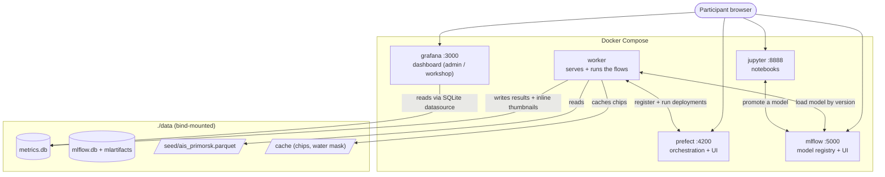
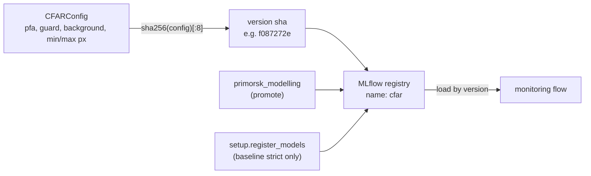
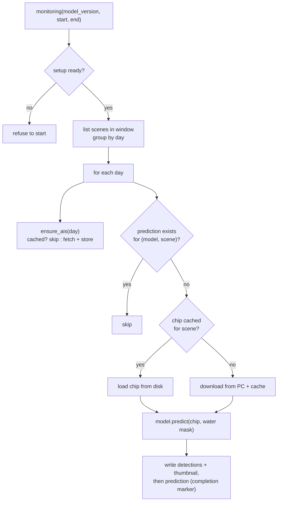
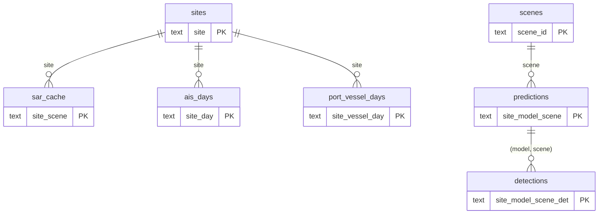

# ML4EO Architecture

How the pieces fit together. Diagrams are [Mermaid](https://mermaid.js.org/) so they render on GitHub and stay in version control. Source of truth: `docker-compose.yml`, `pipeline/`, and `grafana/`.

## 1. Services

`docker compose up` brings up five containers. They share the project's `./data` directory through bind mounts.

`metrics.db` is the integration point: the worker writes results, Grafana reads them. MLflow is the separate model side: the notebook (or setup) registers CFAR versions there, and the worker loads them back by version.

## 2. A CFAR model is a versioned config

CFAR has no training step, so a "model" is a parameter set. We content-hash the config into a short version sha and register it as an MLflow pyfunc model. Identical params always produce the same sha, which is what makes skip-if-present correct.

## 3. The monitoring flow (a daily loop)

The unit is a day. `monitoring` lists the scenes in the window, groups them by day, and runs each day in order. `process_day` is the same logic for one day and is its own deployment. Two levels of skip avoid repeated work.

The prediction row is written **last**, so its presence means the scene is fully done — a half-failed scene retries cleanly.

## 4. The schema (metrics.db)

Keyed so nothing is recomputed. Scene metadata is intrinsic; the chip, AIS, and results are scoped to the site; predictions and detections are also scoped to the model version.

- `scenes` — intrinsic, bbox-independent metadata.
- `sar_cache` — chip download ledger, `(site, scene)`.
- `ais_days` / `port_vessel_days` — AIS count + fleet detail, `(site, …)`, model-independent.
- `predictions` — per `(site, model_version, scene)`; what Grafana reads, filtered by the model dropdown.
- `detections` — per detection; where two models visibly differ.

## 5. Module map

| File | Role |
|------|------|
| `pipeline/config.py` | port box, default window, coverage threshold |
| `pipeline/data.py` | per-day scene listing (live STAC) + per-day AIS fetch |
| `pipeline/detector.py` | CFAR detector; `detect()` is the whole thing |
| `pipeline/models.py` | `CFARConfig`, content-sha versions, MLflow register/load |
| `pipeline/metrics.py` | SQLite schema + writers (the integration point) |
| `pipeline/flows.py` | `process_day` and the sequential `monitoring` flow |
| `pipeline/setup.py` | idempotent provisioning (schema, mask, AIS seed, models) |
| `pipeline/deploy.py` | registers `setup` / `monitoring` / `process-day` |
| `scripts/reset.sh` | token-free clean slate |
| `grafana/` | provisioned datasource + dashboard (with the `$model_version` variable) |
